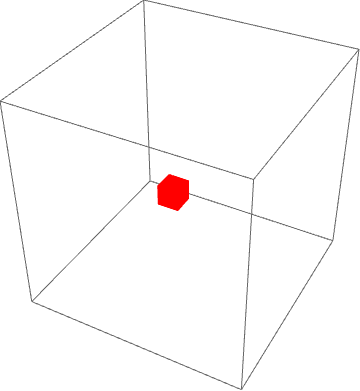
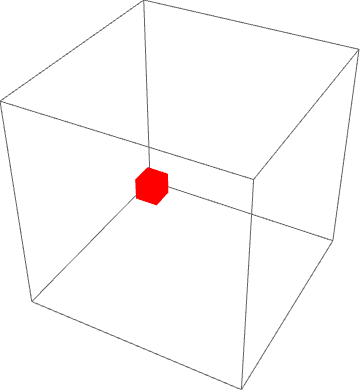

## First cool example:

* Size of this box:  10 x 10 x 10
* Initial conditions:  
** Position ->  5, 5, 5;  
** Velocity ->  1, 1, 1;  
** Total number of time steps -> 50;

## Second cool example:

* Size of this box:  10 x 10 x 10
* Initial conditions:  
** Position ->  5, 5, 5;  
** Velocity ->  1, 1, 2;  
** Total number of time steps -> 50;

