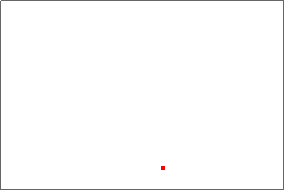

# https://wolfr.am/mAuOX0XK

This repository was made for the Homework Assignment for Wolfram Summer School 2017.
The "FunwithPhysicsin2D.nb" file in this repository contains code for implementing
the steps described in this readme file.

## Author: Bhubanjyoti Bhattacharya
## Date: June 21,2017

## Motion of a classical particle in a box (2 dimensions)

Here we will describe the motion of a classical particle inside a box with hard walls.
The particle will be represented by a single unit of a 2D (or 3D) raster. The interactions
with the walls will be considered elastic, i.e. such interactions simply reverse the direction
of motion perpendicular to the wall.

### The first step is to create a box and a point particle with given coordinates within the box.

We first create a 2-dimensional raster with one of the elements highlighted using a different color:
```
mybox[{mx_Integer, ny_Integer}, {px_Integer, qy_Integer}] := 
  Graphics[Raster[
    ReplacePart[
     ConstantArray[{1, 1, 1}, {ny, mx}], {qy, px} -> {1, 0, 0}]], 
   Frame -> True, FrameTicks -> None];
mybox[{20, 10}, {5, 5}]
```


### The second step is to animate this box

(Note that the .nb file in this repository has more steps (more detailed description of the process I followed))
(Note also that we will use discrete time steps to describe the motion, to use this in conjunction with the Raster function)

```
mytimeAnimatedbox[{mx_Integer, ny_Integer}, {x0_Integer, 
    y0_Integer}, {vx_Integer, vy_Integer}] := 
  Animate[mybox[{mx, ny}, {x0 + vx t, y0 + vy t}], {t, 0, 
    Min[(mx - x0)/vx, (ny - y0)/vy], 1}, AnimationRunning -> False];
mytimeAnimatedbox[{20, 10}, {5, 5}, {1, 1}]
```


Above we made a 20 x 10 raster in 2 dimensions. The particle is started with coordinates (5,5).
The new function takes values (vx,vy) which describe the speed of the particle in x and y directions respectively.

### The third step is to figure out what happens after collisions with a wall.

The particle's motion in 2D can be broken down into two independent motions in the x and y directions.
In our simple case these two motions are similar to each other. We can therefore describe both motions 
with the same function.

Here we will try to figure out the function that describes the position of the particle 'n' time steps after it starts.
The idea is simple as follows:
* If incrementing the position by any number of time steps does not result in the particle hitting the wall boundaries,
then the particle's position follows the simple rule $x = x_0 + v_x t$
* If the particle hits a wall, we assume that the collision is elastic, so its velocity perpendicular to the wall 
simply changes sign. 
The above two rules can be implemented using the following function:
```
posn[pos_Integer, v_Integer, posmax_Integer, t_Integer] := 
  1 + If[EvenQ[Floor[(pos + v (t - 1))/(posmax - 1)]], 
    Mod[pos + v (t - 1), 
     posmax - 
      1], (posmax - 1) Floor[(pos + v (t - 1))/(posmax - 1) + 1] - 
     pos - v (t - 1)];
```

In order to understand the above function we can plot it as a function of time steps. Below
we plot it for the first 50 time steps:
```
ListLinePlot[Table[{n, posn[5, 1, 10, n]}, {n, 0, 50}]]
```


### The final step is to put all of this together to actually obtain the result

The code that crteates the two-dimensional box for us as follows:
```
myFinalAnimatedbox[{m_Integer, n_Integer}, {x_Integer, 
    y_Integer}, {vx_Integer, vy_Integer}, tt_Integer] := 
  Animate[mybox[{m, n}, {posn[x, vx, m, t], posn[y, vy, n, t]}], {t, 
    0, tt, 1}, AnimationRate -> 20];
```


## We will extend this construction to 3 dimensions

### Instead of using a 2D Raster we use a 3D Raster

Using the same techniques as before we can construct the function that generates a free particle in a 3D box:
```
my3DFinalbox[{m_Integer, n_Integer, o_Integer}, {x_Integer, y_Integer,
     z_Integer}, {vx_Integer, vy_Integer, vz_Integer}, tt_Integer] := 
  Animate[my3Dbox[{m, n, o}, {posn[x, vx, m, t], posn[y, vy, n, t], 
     posn[z, vz, o, t]}], {t, 0, tt, 1}, AnimationRate -> 5, 
   AnimationRunning -> True];
my3DFinalbox[{10, 10, 10}, {5, 5, 3}, {1, 1, 1}, 100]
```


More cool examples in 3D are here: "https://wolfr.am/mARXbPv7"

Edited to remove padding from the figures, so that they look more real. The option used is: ```PlotRangePadding -> None```