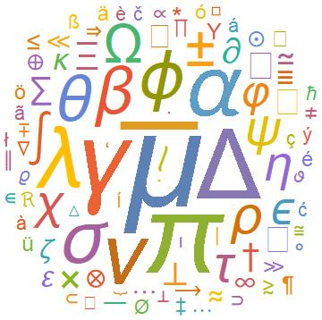
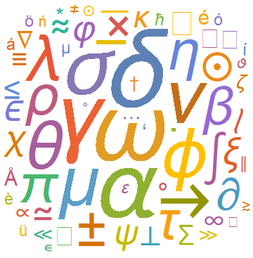
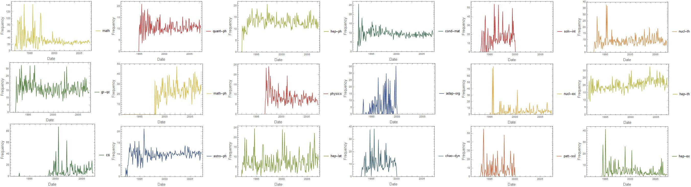
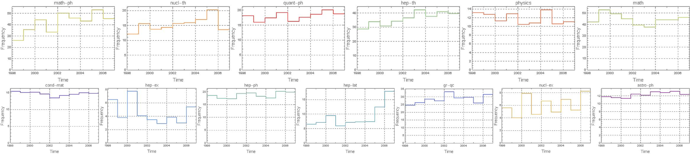
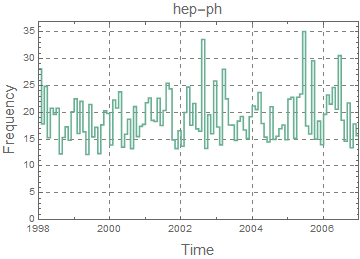

# https://wolfr.am/mDLMfxbm

# What can special characters in a paper on arxiv.org tell us?

## Special characters in a paper on arxiv.org

We would like to characterize a paper on the arXiv by the special characters it contains. We start with the data available from https://mir.fi.muni.cz/MREC/.
We analyze this data to find out the frequency of special characters (like greek and/or mathematical symbols). We would like to study this as a function of
the time at which the paper appeared to see if there was a certain period of growth, stability, and decline of usage of that character.

After importing the data we use simple parsing techniques to make an association between special characters / symbols used in an arXiv document and their
frequencies of occurrence. Given the file path of an article we wrote the following function to make the preliminary association:
```
unwantedSymbols = 
  FromCharacterCode /@ ({Range[168], 8201, 8211, 8217, 8220, 8221, 
      8242, 8243, 8289, 8290, Range[8593, 8601], 8764, 8805, 8818} // 
     Flatten);
allSymbols[article_] := 
  KeyDrop[Counts[Characters[Import[article, "Text"]]], 
   unwantedSymbols];
```

To visualize the input data we made a word cloud of all symbols available in the hep-ph arXives in 2006:


We made another visual for the astro-ph arXives to show the evolution of the word cloud from 1995 till 2006:


Also we produced some DateListPlots for the various arXives. In these plots we represent the frequency of 
occurence of the character $\alpha$ in different arXives over time. (We have normalized the frequencies
based on the number of articles; if there were no articles over some time period we have set the frequency 
to zero for that period.)


Clearly some arXives, especially hep-ph and hep-th show a fairly large and stable frequency of usage of 
$\alpha$ compared to some other arXives.

The data analysis is complicated by the shear number of documents to analyze. Our next step is to set up
a database and use that for further, more refined analyses.

## Creation of a database

We have now added a database file "fullDataset.mx" to this repository. Using the ```Dataset``` function in 
Mathematica we have prepared this dataset. Also included now are the files "Database.nb" and "DataAnalysis.nb"

We can now produce plots for the variation of appearance of the symbol $\alpha$ over several years in different 
arXives. We have also added the feature where in these plots we can modify the bin size over several months 
(between 1 and 12 months). A few example figures are below:




We also created a set of Word Clouds to visualize all the symbols used in papers in the different arXives over 
the entire corpus of data files used. This is what it looks like:


In order to make the above word clouds we used the following simple code snippet:
```
arXivCloud[arxiv_] := 
  WordCloud[
   Merge[fullDataset[Select[#Type == arxiv &]][All, "Symbols"]//Normal, Total], 
     PlotLabel -> Style[arxiv, 30]];
SetAttributes[arXivCloud, Listable];
cloudTable = arXivCloud@arXives;
ImageCollage[cloudTable, Background -> None, Method -> "Rows"];
```

We also studied the closeness of different branches of arXiv as shown by the most 
prominent symbols in each paper of each arXiv Type using the ```ClusteringTree``` 
function. The clustering tree graph looks like this:


## Data Science Objective

The eventual goal of the project is to use machine learning techniques to see if we can get meaningful information about the scientific content of a paper,
by studying the special characters used in it. We will use a small subset of papers as a training set to characterize the meaning of each special character.
The idea is to learn from the papers in the training set, where the algorithm learns about a special character by analyzing the words that appear close to 
it in the text.

We used the function ```Classify``` on our dataset where the classification was done using non-stopwords in the title and the symbols in a paper to classify 
it by the arXiv category for the year 2000. The following is a snippet of the code we used with Classify:
```
trainTitleWords[arXiv_] := Counts[Flatten@Normal@dataSet[arXiv][All, "Title"]];
trainSymbols[arXiv_] := Counts[Flatten@Keys@Normal@dataSet[arXiv][All, "Symbols"]];
trainBuzz[arXiv_] := Keys[Merge[{trainTitleWords[arXiv], trainSymbols[arXiv]}, Total]] ->
    arXiv;
trainingData = trainBuzz /@ arXives;
classifier = Classify[trainingData];
``` 
We then checked how the ```classifier``` performs on data from years other than 2000. We picked 881 articles to test our ```classifier```on and found that 
the classifier function and found:
```
<|True -> 319, False -> 562|>
```
This indicates a low success rate (~ 36%), and shows that our classifier function needs input that is further processed. The idea is to feed in the
probability of obtaining each arXiv class given the different symbols that occur in a paper. In order to perform this task we will need to extract more
information from our corpus, which is clearly the future step.

### Early versions of project notebooks are available inside the "other notebooks" folder here: https://wolfr.am/mV68VBn7