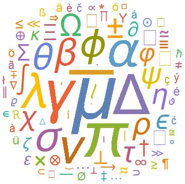
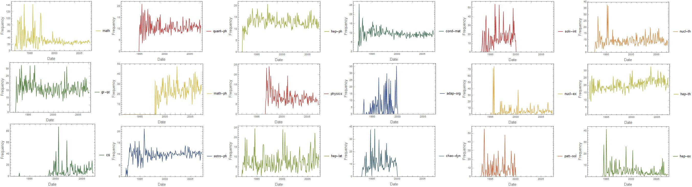

# https://wolfr.am/mDLMfxbm

# What can special characters in a paper on arxiv.org tell us?

## Special characters in a paper on arxiv.org

We would like to characterize a paper on the arXiv by the special characters it contains. We start with the data available from https://mir.fi.muni.cz/MREC/.
We analyze this data to find out the frequency of special characters (like greek and/or mathematical symbols). We would like to study this as a function of
the time at which the paper appeared to see if there was a certain period of growth, stability, and decline of usage of that character.

After importing the data we use simple parsing techniques to make an association between special characters / symbols used in an arXiv document and their
frequencies of occurrence. Given the file path of an article we wrote the following function to make the preliminary association:
```
unwantedSymbols = 
  FromCharacterCode /@ ({Range[168], 8201, 8211, 8217, 8220, 8221, 
      8242, 8243, 8289, 8290, Range[8593, 8601], 8764, 8805, 8818} // 
     Flatten);
allSymbols[article_] := 
  KeyDrop[Counts[Characters[Import[article, "Text"]]], 
   unwantedSymbols];
```

To visualize the input data we made a word cloud of all symbols available in the hep-ph arXives in 2006:


We made another visual for the astro-ph arXives to show the evolution of the word cloud from 1995 till 2006:


Also we produced some DateListPlots for the various arXives. In these plots we represent the frequency of 
occurence of the character $\alpha$ in different arXives over time. (We have normalized the frequencies
based on the number of articles; if there were no articles over some time period we have set the frequency 
to zero for that period.)


Clearly some arXives, especially hep-ph and hep-th show a fairly large and stable frequency of usage of 
$\alpha$ compared to some other arXives.

The data analysis is complicated by the shear number of documents to analyze. Our next step is to set up
a database and use that for further, more refined analyses.

## Data Science Objective

The eventual goal of the project is to use machine learning techniques to see if we can get meaningful information about the scientific content of a paper,
by studying the special characters used in it. We will use a small subset of papers as a training set to characterize the meaning of each special character.
The idea is to learn from the papers in the training set, where the algorithm learns about a special character by analyzing the words that appear close to 
it in the text.